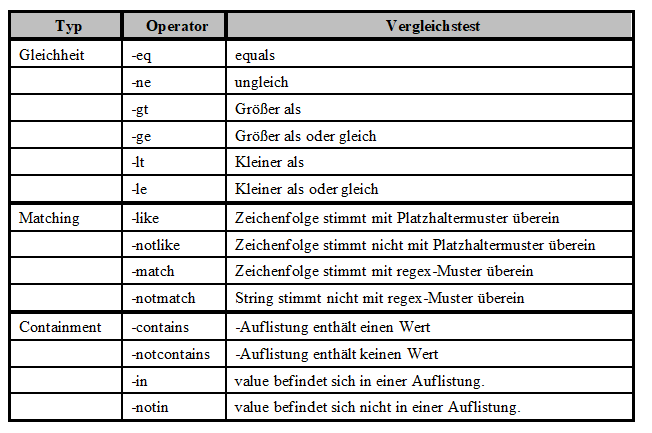
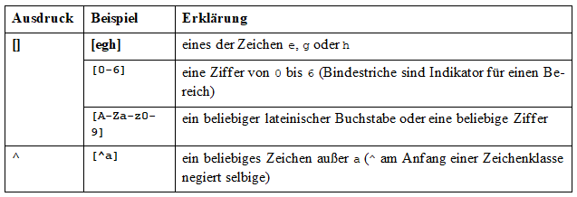
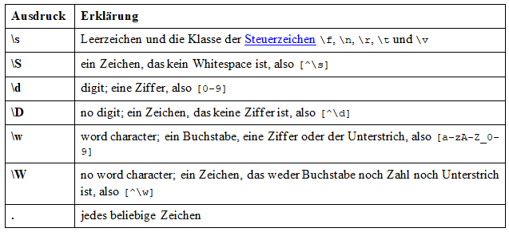
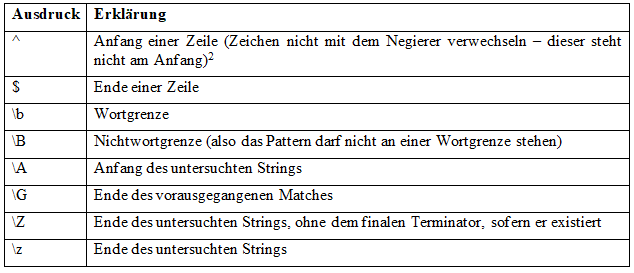
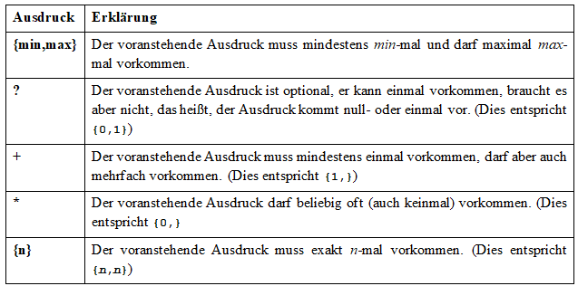
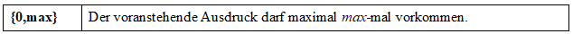

# Powershell 

## Allgemein

- Powershell ist eine Interpretierte sprache die Comands in CMDlets umwandelt
- muss nicht compiled werden
- live runtime

```cd``` ==Interpreter==> ```set-location```

<br>


## CMC befehle zu Powershell 

- `cd` => `Set-Location`
- `cls` => `Clear-Host`
- `copy` => `Copy-Item`
- `dir` => `Get-ChildItem`
- `echo`=> `Write-Output`
- `rmdir` => `Remove-Item`
- `ipconfig` => `Get-Host`

<br>

## CMD befehle die es nicht in Powershell gibt

- `ping` => `Test-Connection`
- `ipconfig` => `Get-NetIPConfiguration`
- `tracert` => `Test-NetConnection`
- `nslookup` => `Resolve-DnsName`
- `arp`=> `GetNetneighbour`

<br>

## Aliase

Aliase sind eine kürzere Eingabe von Cmdlets. Dadurch kennt und versteht PowerShell CMD befehle.
`dir`wird duch  `Get-ChildItem` ersetzt. 


<br>

## Umgebungsvariablen

- Speichert Infos zur Betreibssystem umgebung
- Infos über Betriebssystempfand
- Variablen die Systemweit abgespeichert werden
- Liste der Umgebungsvariablen: `Get-ChildItem env:`
- Zeige den Aktuellen Umgebungsvariablen  von  path an: `Get-ChildItem env:path`

<br>

## Cmdlets

``` Test-Connection -count 2 127.0.0.1 ```

Verb-Objekt Prameter Option

#### Verben: 
- `Get`
- `Set`
- `Add`

<br>

## Pipeline |

Bsp: `Get-Comand-Name where-Object Name -like write`
(Filtert die Ausgabe nach Get-Comand-Neme nach write)

## Vergleichsoperatorn



## Ausgabemanipulation

- `Where-Object`
- `Select-Object`
- `Sort-Object`
- `Measure-Object`

<br>
<br>

# Powershell Scripting

<br>

## Kommentare

`#`

<br>

## Variablen

Variablen sind Dynamisch. Typ muss nicht deklariert werden.

`$x = 1` oder `$y = "Hello World"`

<br>

## Eingabe

`$Anzahl = Read-Host -Prompt "Zahl Eingeben"`

<br>

## Ausgabe

`Write-Host "Hello World"`

<br>

## Arrays

`$array = @{"one", "two", "three"}`

`Write-Host $array[0]` => one

Länge der arrays: `array.length` => 3

<br>

## If
```
$var = 4

if ($var -eq "1"){
    Write-Host "var is 1"
}

else{
    Write-Host "var is not 1"
}
```

<br>

## For
```
for ($=0; $i -lt 4; $i++){
    Write-Host $i
}
```

<br>

## Foreach
```
foreach($i in $array){
    Write-Host $i
}
```

<br>

## While
```
$i = 0

while ($i -lt 4){
    Write-Host $i
    i++
}
```

<br>

## Import an .csv

Importing Csv: ``` $array = Import-Csv -Path c:\datei.txt -Delimiter "," ```

Using the Data: ```$array[0].Port``` oder ```$array[0].Protokol```

<br>
<br>

# RegEx

<br>

## Select-String

Selectiere einen String:
``` Select-String -pattern '<RegEx>' ```

<br>

## RegEx Ausdrücke

- mindestens eine Zahl: `[0-9]`
- mindestens N Zahlen: `[0-9]{N}`
- mit einem Buchstaben beginnend: `^[a-z A-Z]`
- mit einer Zahl zwischen N und M: `[N-M]`
- mit einer einzelnen Zahl beginnend, worauf ein Buchstabe folgt: `^[0-9][a-z A-Z]`
- mit einem m oder r beginnend: `^[mr]`
- mit einem m oder r endent: `[mr]$`
- nur aus Kleinbuchstaben: `[mr] -casesensitiv`





