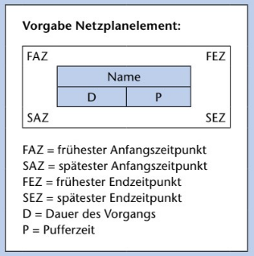

# Projektmanagment

Ein Projekt ist ein Vorhaben mit einem klaren Ziel sowie einem ANfangs und Endtermin

 
 

## Das mageische Dreieck des Projektmanagments

 
 

## **SMART** Regel

- **S**pezifisch
- **M**essbar
- **A**kzeptiert
- **R**ealistisch
- **T**erminiert

 
 

## Steakholder in einem Projekt

- Projektleiter
- Projektmitarbeiter
- Kunden
- Benutzer
- Auftraggeber
- Sponsoren

 
 

## Projektphasen

1. Projektauftrag / Projektdeffinition
2. Projektplanung
3. Projektdurchführung
4. Projektabschkuss

 
 

## Steakholderanalyse vs Machbarkeitsstudie

#### Steakholderanalyse:
Die Steakholderanalyse ermittelt die wesentlichen Ziele, die Motivation und Einstellung der Steakholder im Zusamenhang des geplanten Projektes zu fühzeitigen erkennung der Probleme.

#### Machbarkeitsanalyse:
Die Machbarkeitsanalyse ist eine umfassende Studie, in der die Machbarkeit des Projektes auf verschiedenen Winkelen geprüft wird (Technisch und Wirtschaftlich). Dazu gehört eine Stakholderanalyse und Risikoanalyse.

 
 

 
\pagebreak 

## Lastenheft

Im **Lastenheft** beschreibt der **Auftraggeber** die **Anforderungen** des Projektes

#### Inhalt:

- Deffinition Projektziel
- Anforderung an den Einsatz des Produktes (Zielgruppe)
- Beschreibung der Funktionen
- Qualitätsstandart
- Weitere Informationen

 
 

## Pflichtenheft

Im **Pflichtenheft** beschreibt der **Auftragnehmer** wie genau die **Anforderungen** des Auftraggebers **umgesetzt** werden

 
 

 
\pagebreak 

## Planungsphase

#### Durchführbarkeitsuntersuchung:
	
- fachliche
- ökonomisch
- personell

1. Auswahl des Produkts
2. Voruntersuchung des Produkts
3. Durchführbarkeitsuntersuchung

 
 

## Definitionsphase

#### Einführung:

- Anforderungen ermitteln und beschreiben
- Anforderungen analysieren
- Anforderungen als fachliche Lösung modellieren
- Anforderungen verabschieden

##### Ermitteln der Anforderungen:

- Vollständigkeit
- Konsistenz
- Eindeutigkeit
- Durchführbarkeit

 
\pagebreak 

## Gantt Diagramm

 
 

 
\pagebreak 

## Netzplan

 
 

 
\pagebreak 

## Das Wasserfallmodel

Alle Phases der Projektes müssen Dokumentiert und Veriviziert werden bevor sie es in die nächste Phase geht.

#### Vorteile:
- Einfach
- Kalkulierbare Kosten
- Wenig Managment

#### Nachteile:
- nicht Flexibel
- Kunde ist nur am Start und Ende beteiligt
- Keine korrekturmöglichkeiten im Projektablauf

 
 

 
\pagebreak 

## Top-Down-Methode

Eine Vorgehensweise inder alle Aufgaben in einer Top to Bottom art bearbeitet werden, dabei können sie Optional Parallel laufen. (Erst Desing, Dann Farben und Schrift)

 
 

 
\pagebreak 

## Agile

#### Agile Methode:

Ein eingeübter oder fromalischer Ablauf, der auf dem Prinzuip der agilen Entwicklung basiert.

#### Agil  Prozess:

Ein Prozess ist ein Verlauf oder eine Entwicklung über eine bestimmte Zeit, bei dem was ensteht. (Siehe Bild zum Ablauf)

 
 

 
\pagebreak 

## SCRUM

- Sprints dürfen nicht unterbrochen werden
- SCRUM Master darf sich nicht in die Entwicklung einmischen
- Teams bestehen aus 3-9 Personen
- Product Owner ist die Schnittstelle zwischen Kude und Projektbeteiligten
