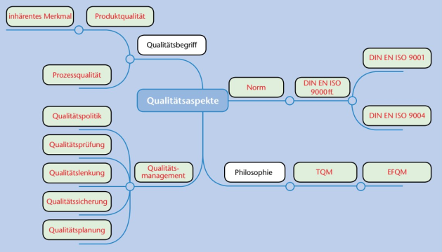
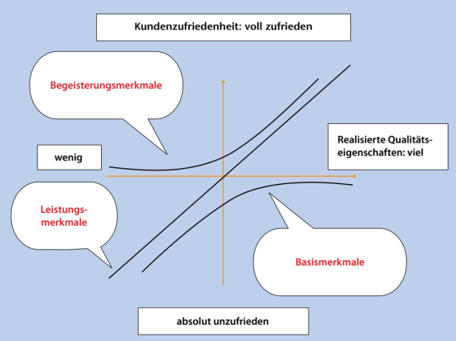
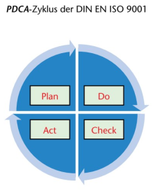
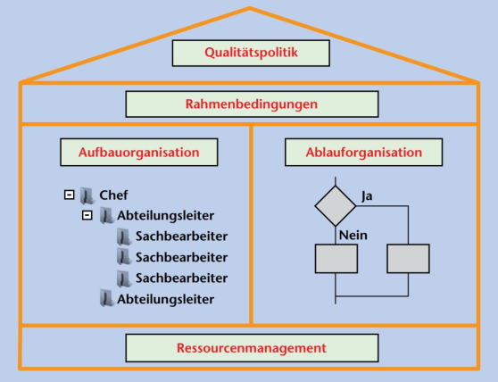
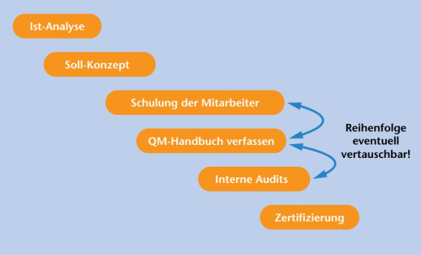
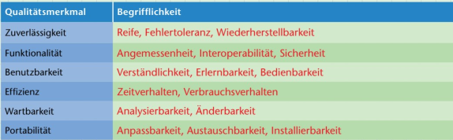

# Qialitätsmanagment

Nach DIN EN ISO 9000

 
 

## Qualitätsaspekte:

 
 

 
\pagebreak 

## Kundenzufreidenheit:

 
 

 
\pagebreak 

## Fachbegriffe

#### Qualität:

Der Grad an Anforderungen und Merkmale die ein Objekt den Anforderungen entspricht. (DIN EN ISO 9000)

#### DIN:

Deutsches Institut für Normung

#### EN:

Europäisches Normungsinstitut

#### ISO:

International Organization für Standardization

#### IEC

International Electronical Commission

 
 

 
\pagebreak 

## DIN EN ISO 9000 ff

- Kundenorientiert
- Verantfortlichkeit der Führung
- Einbeziehung der Mitarbeiter
- Prozessorientierter Ansatz
- Systemorientierter Managmentansatz
- Kontinuirliche Verbesserung
- Sachbezogener Entscheidungsfindungsansatz
- Lieferantenbeziehungen zum gegenseitigen Nutzen

#### 9000:

Difiniert den Begriff Qualitätsmanagment

#### 9001:
Beschreibt die Mindestanforderungen ans Qualitätsmanagment

#### 9004:

Beschäftigt sich mit der Leitung und Lenkung einer Organisation mit dem Ziel des Nachhaltigen Erfolgs =>  **Total Qualitiy Managment TQM**

#### PDCA Zyklus:

 
 

 
\pagebreak 

## Qualitätsmanagmentsystem

 
 

 
\pagebreak 

## Qualitätsplanung vs Qualitätspolitik

#### Qualitätsplanung:

Teil des Qualitätsmanagment, der auf das **Festlegen der Qualitätsziele** und notwendigen **Arbeitsprozesse und Resourcen** spezialisiert ist um das Qualitätsziel zu **ereichen**.

#### Qualitätspolitik:

**Leitung** der aktuellen **Qualitätssituation** und Anpassung.

 
 

## Softwarequalität

 
 

## Barrierefreiheit

#### BITV 2.0:

Die Barrierefreiheit-Invormations.Verordnung hat das Ziel, grundsätztlich uneingeschränkte Gestalltung moderner IT und Kummunikationstechnik zu ermöglichen. 

#### Berrierefreiheit in der IT:

Das desingen von Webseiten, Programmen und OS sodass auch Menschen mit Körperlichen Behinderungen / Alte Menschen sie nutzen können.