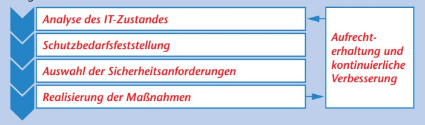
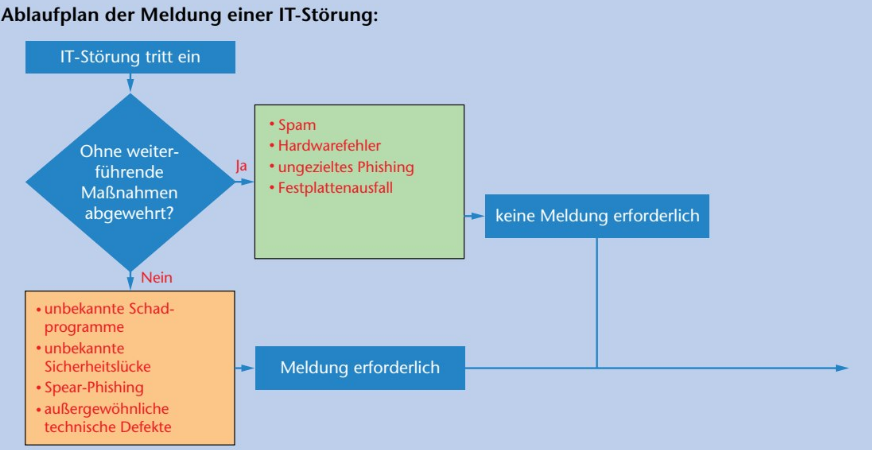
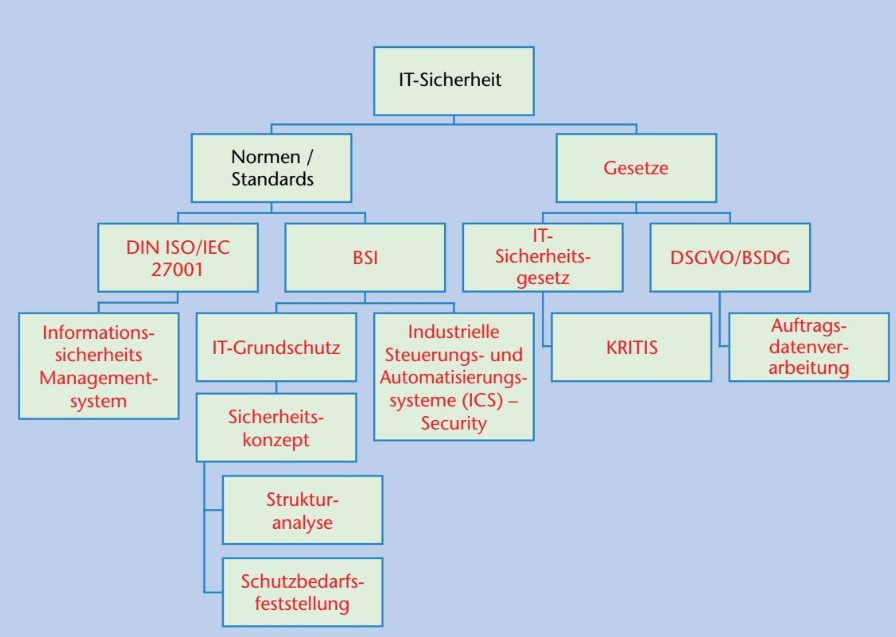

# IT-Sicherheit

 
 

## Methoden der Identitätsdiebstahl

- Phising
- Vishing
- Pharming
- Spoofing
- Nicknapping

 
 

## Schadprogramme & Maleware

- Spam
- Spyware
- Adware
- Virus
- Trojaner
- Wurm
- Ransomware

 
 

## Andere Schädliche Dinge

- DDos
- Botnetzte 
- APT-Angriffe
- Mining Software

 
 

 
\pagebreak 

## Maßnahmen gegen Phishing

- Virenscanner aktuell halten
- Niemals TAN's und Kennwörter weitergeben 
- Verdächtige Emails erkennen (Schlechte Rechtschreibung, Schlechtes Vormat)

 
 

## Maßnahmen gegen Ransomware

- Alle Netzwerkverbindungen Lösen
- Keine Anmeldung von Admin Accounts
- Backups einspielen oder System neuinstallieren

 
 

## Maßnahmen gegen DDos

- Gute Passwörter bei Netzwerkgeräten
- Deaktivieren von Universal Plug and Play
- Erstellen eines Honeypots

 
 

## BSI

Bundesamt für Sicherheit in der Informatik

 
 

 
\pagebreak 

## IT-Grundschutz

 
 

## Sektoren der Kritischen Infrastruktur

- Transport
- Finaz / Versicherungswesen
- Gesundheit
- IT / Telekomunikation
- Ernährung
- Wasser
- Energie

 
 

## Ablauf bei IT-Störungen

 
 

## IT-Sicherheit Mindmap

 
 

 
\pagebreak 

## Verschlüsselung

#### Symetische Verschlüsselung:

Der gleiche Schlüssel wird von beiden Seiten gleichzeitig zur ver und endschlüsselung von Daten verwendet.

#### Asymmetrische Verschlüsselung

Es wird ein Geheimer und Öffentlicher schlüsselung verwendet. Dabeiu wird der Öffentliche Schlüssel nur mit den zu kommunizierenden Personen gegeben.

 
 

## Verschlüsselungsverfahren

#### Modern:

- AES
- Diffie Hellman
- Blowfisch
- PGP

#### Veraltet:

- DES
- Trippel DES
- RSA-OAEP
