# IT-Systeme

 
 

## Datensicherung

#### Vollsicherung:

Eein Komplettes Abbildes der Daten. Sicherung einer ganzen Festpaltte inklusive Strukturen und Unterordner.

#### Differenzielle Sicherung:

Die aktuellen Daten werden mit der Letzten Vollsicherung verglichen und es wird nur die Veränderung (Differenz) abgespeichert.

#### Inkementelle Sicherung:

Es wird nur das gesichert, was sich seit der letzten vollsicherung geändert hat.

 
 

## Revisionssichere Datensicherung

- Vollständig
- Schuzu vor Veränderung / Verfälschung
- Sicherung vor Verlust
- Nutzung durch Berechtigte
- Dukumentation des Verfahren

 
 

## Serielle vs Parallele Datenübertragung

##### Parallele Datenübertragung:

Es wird auf Physisch getrenten Leitungen "parallel" übertragen. Meist sind es 8 Leitungen für 8 Bits. Die Fehleranfälligkeit wird höher desto länger das Kabel ist.

#### Serielle Datenübertragung:

Es wird ein Bit nach dem anderen auf einer Leitung gesendet. Fehleranfälligkeit ist sehr gering und hohe datrenraten sind möglich.

 
 

 
\pagebreak 

## Logikgatter

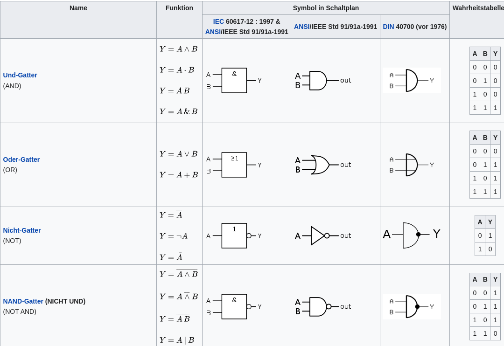
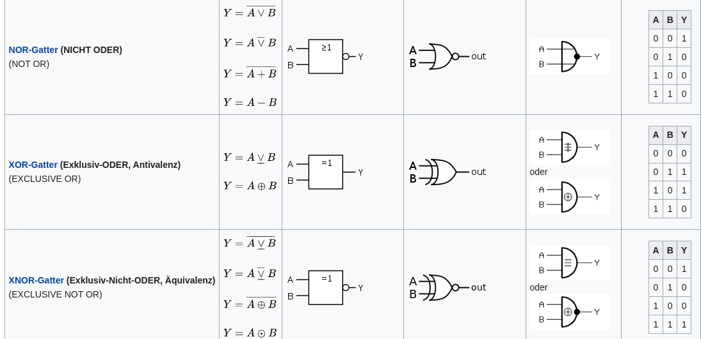

 
 

 
\pagebreak 

## Elektrik

#### Grundgrößen:

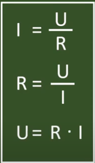

#### Stromverbrauch:

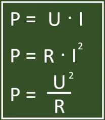
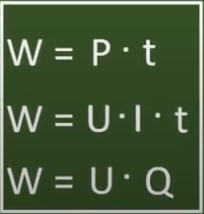

 
 

 
\pagebreak 

## Speicherberechnung

#### Bild:

**Speicherbedaft = Auflösung x Farbtiefe**

Bsp: Speicherbedarf = 1920 x 1080 x 24bit

#### Bilder / Video:

**Speicherbedaft = Auflösung x Farbtiefe x Bilder_pro_Sekunde x Zeit**

Bsp: Speicherbedarf = 1920 x 1080 x 24 bit x 30 FPS x 120s 

#### Scans:

**Speicherbedaft = Auflösung x Farbtiefe x Bilder_pro_Sekunde x Zeit**

**1 inch = 2,54cm**

Bsp: Speicherbedarf = ((15/2,54) * 300dpi) x ((10/2,54) * 300dpi) x 24 bit

 
 

 
\pagebreak 

#### Dezimalsystem:

Zur berechnung für **Bandbreite / Datenraten**

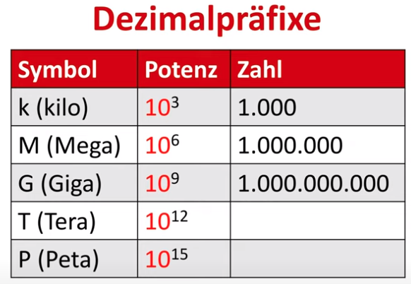

#### Binärsystem:

Zur berechnung von **Spichergrößen**

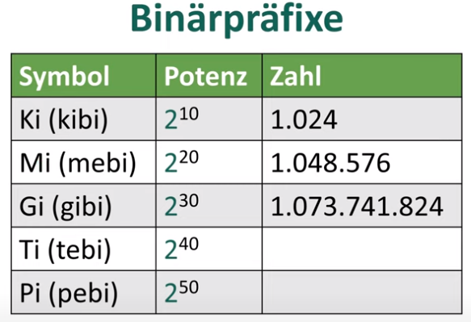

 
 

 
\pagebreak 

## Cloudcompouting

### **IaaS** – Infrastructure as a service

- Geringster Service Level
- Virtuelle Maschinen, Speicherplatz, Netzwerk
- Ressourcen werden zur Verfügung gesetzt

#### Vorteile:

- Gut kalkulierbar, günstige Preise
- Der Kunde kann Software individuel konfigurieren, muss er aber nicht

#### Nachteile:

- Der Kunde kann Software individuell konfigurieren, muss er aber nicht
- Der Kunde muss sich um das Betriebssystem kümmern
- Ersparnis bei den Betriebskosten ist gering

### **PaaS** – Platform as a service

- Mittlerer Service Level 
- Neben der Server Infrastruktur wird zusätzlich das Betriebssystem vom CSP geplegt

#### Vorteile:

- Dezentral und horizontal skalierbar, individueller Leistungsabruf möglich 
- Verantwortung für das BS liegt beim Anbieter, der oft besser spezialisierte Mitarbeiter hat 
- Entlastung der hauseigenen IT-Abteilung von Routinetätigkeiten

#### Nachteile:

- Teurer als IaaS 
- Kontrollverlust über das OS 
- Individuelle Anpassung des BS mit höheren Kosten verbunden

 
\pagebreak 

### **SaaS** – Software as a service

- Höchster Service Level 
- Hier wird Server-Infrastruktur mit Betriebssystem + Software zur Verfügung gestellt

#### Vorteile:

- Der Anwender braucht sich um keine Details mehr kümmern, beschränkt sich auf Benutzeroberfläche, Vergabe von Nutzerrechten etc.

#### Nachteile:

- Fast keine individuelle Anpassung möglich 
- Kostenintensiv 
- Evtl. schwierige Kontrolle über die Daten, Vereinheitlichte Handhabung der Daten schwierig (Einhaltung der Compliance)

 
 

 
\pagebreak 

## Servervirtualisierung

Software und Betribssysteme können mithilfe einer Virtualisierungssoftware erstellt und zum laufen gebracht werden. Ressourcen können belibig in einer VM Hinzugefügt, Erweitert, Gelöscht und geänert werden.

#### Vorteile:

- Bessere Auslastung von Systemressourcen
- Wenig physische Server notwenig
- Geringe bereitstellungszeit
- Einfache Wartung

#### Nachteile:

- Fällt ein Server aus, sind alle VM's betroffen
- Geteilte Ressourcen wie RAM können überlastet werden.

 
 

## Hosted vs Bear Metal

#### Hosted:

- Setzt direkt auf die Hardware auf
- Effizientes verwalten von Ressourcen
- Unterstützt gleichzeitig vile VM's
- Hypervisor ist das OS

#### Hosted:
- Anwendung läuft beim Hoster
- grbrüuchlich im Privaten einsatzt
- einfache nutzung

 
 

## Snapshot

Ein Snapshot ist ein ABild eines Systems das einen bestimmten Zeitpunk des Systems Abbildet.

 
 

 
\pagebreak 

## Hypervisor

- MS Hyper-V (OS Basiert)
- VM-Ware ESXI (Hardware Basiert)
- Oracle Virtaulbox (OS Basiert)
- KVM (hardware Basiert)
- Clitrix Hypervisor (OS basiert)

 
 

## Betreibssysteme

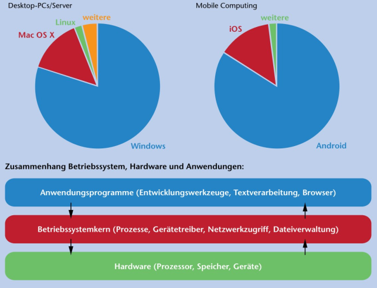

 
 

 
\pagebreak 

## Grafische Schnittstellen

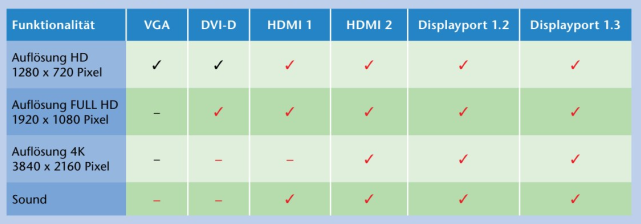

 
 

## Industrie 4.0

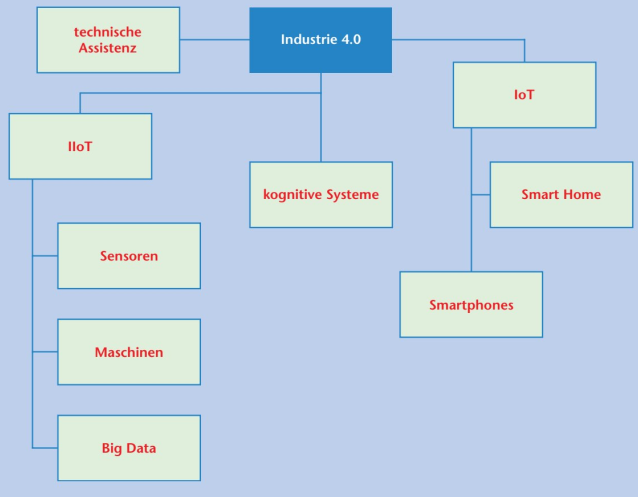

 
 

 
\pagebreak 

## RAID

Ein RAID-System dient zur Organisation mehrerer physischer Massenspeiche (üblicherweise Festplattenlaufwerke oder Solid-State-Drives) zu einem logischen Laufwerk, das eine höhere Ausfallsicherheit oder einen größeren Datendurchsatz erlaubt als ein einzelnes physisches Speichermedium. Der Begriff ist ein Akronym für englisch **„redundant array of independent disks“**, also „redundante Anordnung unabhängiger Festplatten“ (ursprünglich englisch „redundant array of inexpensive disks“; deutsch „redundante Anordnung kostengünstiger Festplatten“; was aus Marketinggründen aufgegeben wurde).

#### RAID 0:
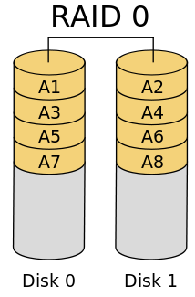

#### RAID 1:
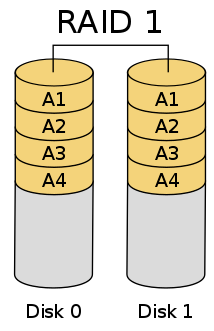

 
\pagebreak 

#### RAID 5:
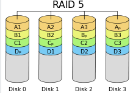

#### RAID 10:
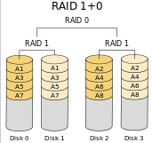