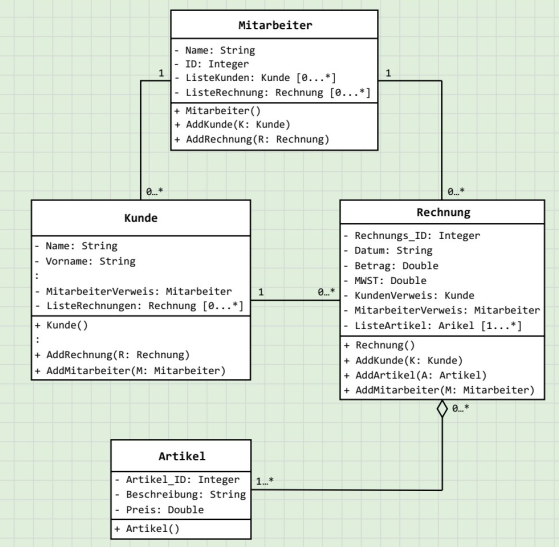
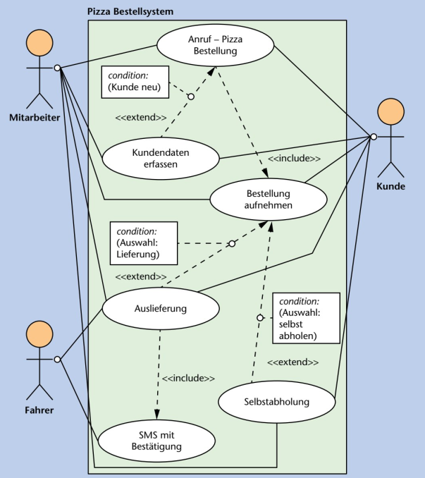
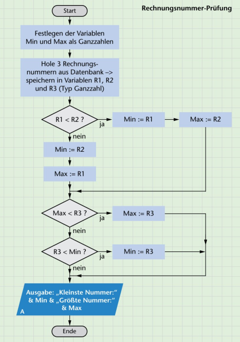
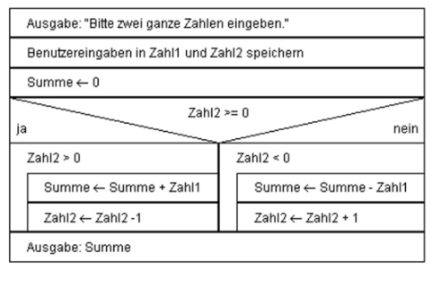
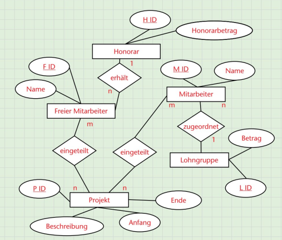
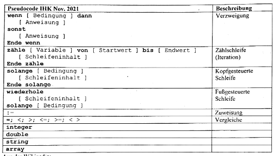
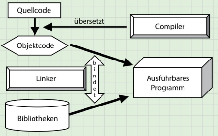
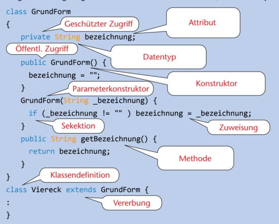
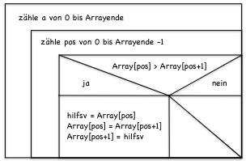
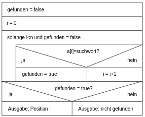

# Software

<br>
<br>

## UML Diagramme



<br>
<br>
<div style="page-break-after: always; visibility: hidden"> 
\pagebreak 
</div>

## USE-Case-Diagramme / Anwendungsdiagramme



<br>
<br>
<div style="page-break-after: always; visibility: hidden"> 
\pagebreak 
</div>

## Programm Ablauf Diagramm 



<br>
<br>
<div style="page-break-after: always; visibility: hidden"> 
\pagebreak 
</div>

## Struktogramm



<br>
<br>
<div style="page-break-after: always; visibility: hidden"> 
\pagebreak 
</div>

## ER-Diagramm



<br>
<br>
<div style="page-break-after: always; visibility: hidden"> 
\pagebreak 
</div>

## Pseudocode



<br>
<br>
<div style="page-break-after: always; visibility: hidden"> 
\pagebreak 
</div>

## Prozess Quellcode



<br>
<br>
<div style="page-break-after: always; visibility: hidden"> 
\pagebreak 
</div>

## Java Objekt Orienteirung Basics



#### Kalassen:

**Klassen** sind **Baupläne** für **Objekte**

#### Objekte:

**Objekte** sind **Instanzen** von **Klassen**

#### Vererbungen:

**Vererbung** ist das Prinzip das eine **Unterklasse** die **Atribute** eine **Mutterklasse** **erben** kann

<br>
<br>
<div style="page-break-after: always; visibility: hidden"> 
\pagebreak 
</div>

## Sortier Algo (Bubble Sort)



```   
public class Bubble_Sort {
    
    public static void main(String[] args) {
        
        int array_unsorted[] = {1,2,43,1,5,26,7,328,29,10};
        
        int array_sorted[] = bubble_Sort(array_unsorted);


    }

    public static int[] bubble_Sort(int[] array){

        for(int i = 0; i < array.length; i++){
            for(int n = 0; n < array.length -1; n++){
                if(array[n] > array[n+1]){
                    int temp = array[n];
                    array[n] = array[n+1];
                    array[n+1] = temp;
                }
            
            }
        }

        return array;
    }
}
```

<br>
<br>
<div style="page-break-after: always; visibility: hidden"> 
\pagebreak 
</div>

## Such Algo (Lineare Suche)



```
public class Linear_Search {
    public static void main(String[] args) {
        
        int array[] = {1,2,3,4,5,6,7,8,9,10};
        int to_search = 7;

        int array_pos = linear_Search(array, to_search);
        System.out.println("The position of the element is: " + array_pos);

    }

    public static int linear_Search(int[] array, int search){

        boolean found = false;
        int i = 0;

        while(i < array.length && found == false){
            if(array[i] == search){
                found = true;
            }

            else{
                i++;
            }
        }

        return i;
    }

}
```