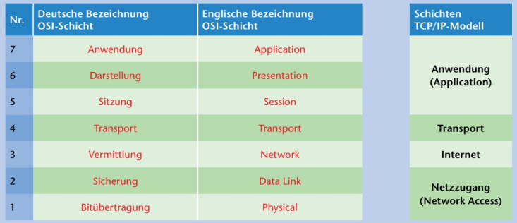
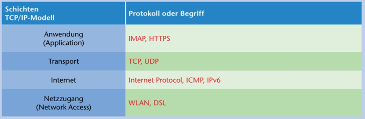
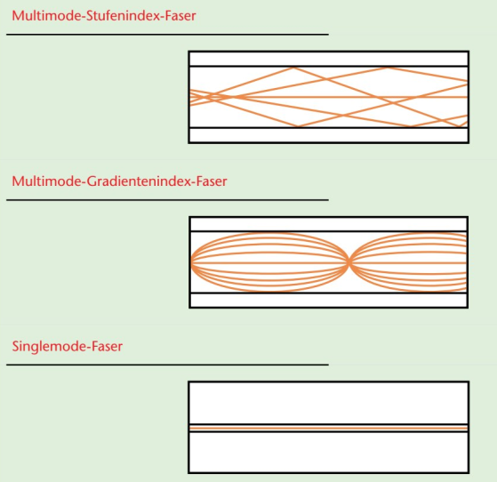
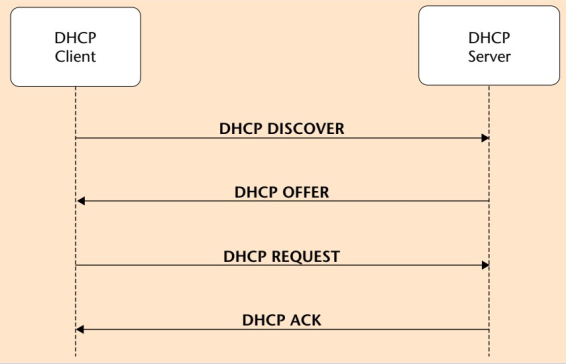

# Netzwerke

 
 

## OSI Modell

 
 

## TCP/IP Modell

 
 

 
\pagebreak 

## Ports

- **SSH** 22
- **HTTP** 80
- **HTTPS** 443
- **FTP** 21
- **Telnet** 23
- **DNS** 53
- **SMTP**  25
- **IMAP** 993

 
 

## Glasfaser

 
 

 
\pagebreak 

## DHCP

