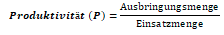
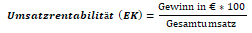
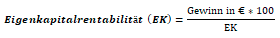
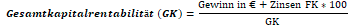
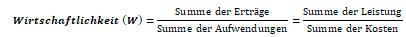
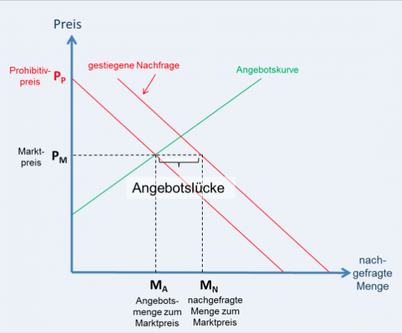
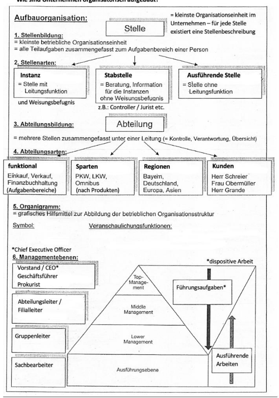
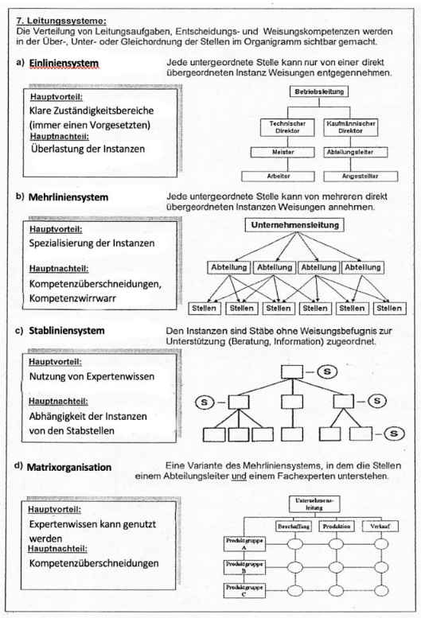

# Arbeits und Geschäftsprozesse

 
 

## Volkswirtschaftliche Produktionsfaktoren

### Menschliche Arbeitskraft

Jede **Tätigkeit** die dazu verwendet wird, um **Güter oder Dienstleistungen** **herszustellen**, die **entlohnt** wird.

#### Arten:

- Ausführende Arbeit
- Leitende Arbeit

#### Abhängigkeit:

- Motivation
- Tageszeit
- Geschick
- Arbeitsumfeld
- Arbeitsmittel

### Boden & Natur

Alle **Grundstücke / Gebäude** als Standorte von **Unternehmen** sowie alle **Bodenflächen und Rohstoffe** und **regenerative Enegrieen**.

#### Problematik:

- Begrenztes Rohstoffaufkommen
- Umweltverschmutzung
- Flächenfraß / Abholzug für Industriegebiete
- Klimawandel und CO2 Außstoß

### Kapital

Alle **finanziellen mittel**, die in **Anlagen und Maschienen Investiert** werden/sind.

 
 

 
\pagebreak 

## Betriebswirtschaftliche Produktionsfaktoren

- **Rohstoffe** = Hauptbestandteil des Endprodukts
- **Hilfsstoffe** = Nebenbestandteil des Endprodukts
- **Betriebsstoffe** = Verbrachsstoffe für den Betrieb der Maschienen
- **Fremdbauteile** = werden ins Endprodukt eingebaut
- **Handelswaren** = Zubehörteile, die gekauft werden ohne Weiterverarbeitung verkauft werden
- **Betriebsmittel** = Alle Anlagen und Einrichtungen (Maschienen, Werkzeuge) die zum herstellung benötigt werden.

 
 

## Substition

Aus wirtschaftlichen Gründen und dem Technischen Fortschritt wird es für den Unternehmer interessanter menschliche Arbeit durch Maschinenarbeit zu ersetzen

- Geringere Arbeitskosten
- Günstigerer Angebotsposten
- Abbau von Arbeitsplätzen

 
 

 
\pagebreak 

## Ausführende vs Dispotive Arbeit

#### Ausführende Arbeit:

Sind **direkt** in die **produktion eingebundnen** => Wenig Entscheidungsspielraum

#### Dispotive Arbeit:

Deschäftigten sich mit mit **Planung, Ogramisation, Kontrolle** der Betrieblichen Abläufe.

 
 

## Betriebsunterscheidung nach Dominaz

#### Energieintensiv:

- Serverfarmen
- Krankenhaus
- Stahlwerk
- Kraftwerk

#### Arbeitsintensiv:

- Handwerksbetriebe
- Dienstleider
- Textielindustrie
- Schmelzerei

#### Kapitalintensiv:

- Forschung
- Entwicklung
- Banken / Versicherungen
- Industriegebiete

#### Materialintensiv:

- Schreinierei
- Moderner Kapitalismus

 
 

 
\pagebreak 

## Moderne Wirtschaftliche Tendenzen / Trends

#### Globalisierung:

**Internationalisierung** der **Märkte**, produziert wird dort, wo es **günstig** ist

#### Outsourcing:

**Ausgliederung** bestimmter betrieblicher **Tätigkeiten** (IT-Support, Consulting, Security. Cloud)

 
 

## Ökonomische Prinzipien

#### Maximalprinzip

Mit **gegebenen Mitteln** soll ein **maximaler Ertrag** erzielt werden

#### Minimalprinzip:

Ein bestimmtes **Ziel** mit möglichst **wenig Mitteln** erreichen

 
 

 
\pagebreak 

## Wirtschaftsektoren

#### Primärsektoren:

**Urproduktion**. Liefert **Rohstoffe** für Produkte. Sind **Standoergebunden**.

- Landwirtschaft
- Forstwirtschaft
- Fischerei
- Bergbau
- Öl / Gas

#### Sukendärer Sektor:

**Prodizierendes Gewerbe**. Verarbeitung von Rohstoffen. **Material / Kapitalintensiv**.

- Grundstoffinstustrie
- Investmenindustrie
- Konsumgüter
- Energie / Wasserversorgung
- Baugewerbe

#### Teritärer Sektor:

**Handel / Dienstleistungen**. Umfasst **aller Unternehmen** der **Volkswirtschaft**, die **Dienstleistungen** Erbringen.

- Handel
- Verkehr, Logistik, Toursimus
- Kreditinstitute / Versicherungen
- Wohnungsvermietung
- Sozialversicherungen

#### Quatärer Sektor:

**Informationsdienstleistung**. Erweiterung der Teritären Sektors mit expertiese auf **interlektuellem** Ansprüchen. **Bildung** ist ein großer Faktor.

- Beratung (Rechstanwälte, Steuerbearter, etc.)
- IT (IT-Dienstleister, Cloud)
- High-Tech (Nanotechhnik, BioTech)

 
 

 
\pagebreak 

## Wirtschaftsziele

#### Wachstumsziel:

- Umsatzsteigerung
- Martanteil ausbau
- Konkurenzunternhemne aufkaufen

#### Erfolgsziel:

- Gewinnmaximierung
- Steigerung der Rentabilität
- mehr Umsatzt

#### Finanzziel:

- Verwendung Dilanzgewinn => Ausschüttung von Rücklagenbildung
- Liquitätsbildung

#### Soziale Ziele:

- Sonderzahlungen
- Firmanfeiern
- Mitarbeiterabatte
- Betriebssport

#### Gesellschaftliche Zeile

- Sponorings
- Stiftungen
- Spenden

#### Ökologische Ziele:

- Recycling
- Mülltrennung
- Ökostrom
- Solaranlagen

 
 

 
\pagebreak 

## Unternehmenskennzahlen:

#### Produktivität:

#### Umsatzrentabilität:

#### Eigenkapitalrentabilitär:

#### Gesamtrentabiliät:

#### Wirtschaftlichkeit:

 
 

 
\pagebreak 

## Marktarten

- **Arbeitsmarkt** = Arbeitgeber und Arbeitnehmer
- **Kapitalmarkt** = Geldanlagen und Kredite
- **Boden / Imobilienmarkt** = Grundstücke, Fleder, Pacht, Miete
- **Gütermarkt** = Angebot und Nachfrage

 
 

## Marktformen

#### Polypol (vollständige Konkurenz)

- viel Nachfrage und Angebote
- Starker Preiswettbewerb
- Anbieter müssen viel Kalkulieren

#### Angebotsoligolop:

- Wenige Angebote viel Nachfrage
- Gefahr bei Preisabsprachen

#### Angebotsmonopol:

- Nur ein Anbieter
- Partner oder Staatliche Eingriffe

 
 

 
\pagebreak 

## Preisbildung am Markt ( bei vollständiger Konkurenz)

- Das Produkt ist hinsichtlich der Qualität identisch
- Vollständige Markttransparenz
- Die Kunden haben keine Präfferenzen
- Sehr hohe Reaktionsgeschwindigkeit der Kunden

## Preisbildung bei Unvollkommenen Markt

- Kunden haben Präfferenzen
- Unvollständige Trazparenz
- Kein Indetisches Produkt
- Jeder Händler hat einen Preisspielraum den er hat

 
 

 
\pagebreak 

## Das Handelsregister

- **Kaufmann** = wer ein Handelsgewerbe betreibt
- **HGB** = Hadelsgesetzbuch
-  Erteilung bestimmter Vollmachten
- Abwicklung von Kaufvertägen
- Firmennamen

#### Erscheinungsformen:

- **IstKaufmann** = Jeder Gewerbeireibender mir kaufmänischer Organisation und vollständiger Buch / Dilanzführungspflicht
- **KannKaufmann** = eder Gewerbebetrieb ohne volle Buchführungs- und Bilanzierungspflicht. Land- und Forstwirtschaftliche Betriebe und Kleingewerbetreibende, die eine Einnahme
- **FormKaufmann** = Jedes Unternehmen in der Rechtsform einer Kapitalgesellschaft (AG / GmbH). Diese sind Buchführungs- und Bilanzierungspflichti

## Hadelsregisterabteilungen

#### Abtreilung A:

Für **eingetragene Kaufleute** (e.K., e.Kfm, e.Kfr.) und **Personengesellschaften** (OHG, KG)

#### Abterilung B:

Für **Kapitalgesellschaften**, also AG, GmbH, UG (haftungsbeschränkt)

#### Inhalt der Eintragung:

- Firma, Fimensitz
- Name des Inhabers bzw. Gesellschafter / Geschäftsführer / Vorstand
- Rechtsform
- Unternehmenszweck
- Name der Prokuristen 
- Eröffnung des Insolvenzverfahren / Liquidation

 
 

 
\pagebreak 

## Firmenarten

- **Personenfirma** = bestehend aus einem oder mehreren Personennamen
- **Sachfirma** = abgeleitet aus dem Unternehmensgegenstand
- **Fantasiefirma** = oft eine Abkürzung oder eine werbewirksame Zeichenfolge
- **Gemischte Firma** = enthält Personennamen und den Unternehmensgegenstand

 
 

## Unternehmensformen

#### Freiberufler:

- i.d.r beratung
- beiten hoch qualifizierte Dienste an

#### Gewerbetreibende:

- dauerhafter Kauf und Verkauf mit Gewinnerzielung
- einfache Dienstleistung
. Unbegrenzte Haftung auch mit dem Privatkapital

#### Einzelunternehmer:

- Kein gesetzliches Midestkapital
- nicht voll buchführungspflichtig
- Gewinn gehört dem Unternehmer allein
- große Entscheidungsfreiheit
- Für Freiberufler entfällt die Gewerbesteuer

 
 

 
\pagebreak 

## Personengesellschaft

#### Gesellschaft bürgerlichen Rechts (GbR):

- wird nicht ins Hadelsregister eingetragen
- kein gesetzliches Mideskapital
- mind. 2 Personen
- ist keine "Firma" vor der Gesetz

#### Offene Hadelsgesellschaft (OHG):

- kein gesetzliches Midestkapital
- relativ einfache Gündung
- breitere EK-Basis
- Haftung mit Privat / Firmenkapital

 
 

 
\pagebreak 

## Firmenzusammenschlüsse

#### Horizontal:

Kooperation zwischen Unternehmen in **derselben Wirtschaftsstufe**.

- Geringere Kosten im EInkauf
- Allgemeine Ersparnisse

#### Vertikal:

Zusammenarbeit von Unternehmen in **vor- nachgelargerten Wirtschaftstufen**.

- Gemeinsame Vorschung
- günsigeren Herstellungskosten
- Baukastensystem für Produkte

#### Diagonal:

Zusammenschluss von Unternehmen die **nichts miteinader** zu tun haben.

- Gemeinsame Werbung (günstiger)
- höhere Verkaufszahlen
- Kartellbildung

 
 

 
\pagebreak 

## Unternehmensorganisation

 
\pagebreak 

 
 

 
\pagebreak 

## Geschäftsprozesse

- Haben einen definierten Anfang und ein eindeutiges Ende
- Bestehen aus einer Kette von Aktivitäten (Teilprozessen)
- Orientieren sich an den Unternehmenszielen
- Erbringen eines Ergebnisses, das einen Kundennutzen hat
- Haben Schnittstellen zu Kunden, Lieferanten und anderen Geschäftsprozessen
- Verursachen Kosten durch den Verbrauch von Ressourcen

**Wertschöpfungskette** = die Gesamtheit aller Geschäftsprozesse im Unternehmen

 
 

 
\pagebreak 

## Vollmachten

#### Allgemeine Handlungsvollmacht (AVH):

Wird auf **Dauer erteilt** und ermächtigt zu Erledigung **aller gewöhnlichen Rechtegeschäfte** im Handelsgewerben

#### Artvollmacht:

Wird ebenfalls auf **Dauer erteilt**, ermächtigt aber nur zu einer **bestimmten Art** von **wiederkehrenden Geschäften** im Handelsgewerbe

 
 

 
\pagebreak 

## Prokura

#### Gesamtprokura:

Ausübung der **Vollmacht nur zusammen mit einem anderen Prokuristen** oder einem **Geschäftsführer**

#### Filialprokura:

Die **Vertretungsvollmacht** ist auf den Betrieb einer **Zweigniederlassung beschränkt**.

#### Einzelprokura:

Ausübung der vollmacht **ohne Mitwirkung einer weiteren Person**, d.h.**Einzelvertretungsvollmacht**

 
 

 
\pagebreak 

## Der Kaufvertrag

- Genaue Bezeichnung was geliefert werden soll, Menge + Preis
- Lieferzeit, Zustand der Ware
- Garantie / Serviceleistungen, Service: Abrechnung, pauschal oder nach Stunden
- Zahlungskonditionen und Fristen, evtl. Skonto, Hinweis auf Boni
- Hinweis auf Abo, wiederkehrende Leistungen
- Nachweise über Qualitätssiegel, Zertifizierungen
- Lieferbedingungen: Frei Haus oder mit Versandkostenpauschale

 
 

## ITSM

**IT Service Managment** => Die Geschäftsprozesse des Kunden sollen optimal unterstützt werden. Wandel von der Informationstechnik hin zur Kunden- und Serviceorientierung.
Kontinuierliche Verbesserung der Effizienz und Qualität der jeweiligen IT – Organisation. Mit dem Kunden soll eine gemeinsame Wertschöpfung erzeugt werden.

 
 

## Der Lebenszyklus einer Software

- Beratung 
- Beschaffung
- Bereitstellung
- Einweisung / Schulung
- HelpDesk / Service
- Kontrolle / Anpassung / Ersatz

 
 

## Typische IT-Serviceartten

- IT Vertrieb / Handel
- Break Fix Support
- Swap Service
- DIY Service
- Live Chat
- Chatbot
- Managed Services
- Serviceanlagen / Portfolio
- Service Level Managment
- Garantieservice / Kulanz

 
 

 
\pagebreak 

## IMAC/R/D

- **I**nstall
- **M**ove
- **A**dd
- **C**hange
- **R**emove
- **D**ispose

 Cloud Dienste

 
 

## Rechtliche Anforderungen

**Governance:**

„Unternehmensverfassung“ Organisations- und Regelsystem des Unternehmen

**Compliance:**

Einhaltung von gesetzlichen Bestimmungen und weiteren Standards, die sich ein Unternehmen selbst gesetzt hat.

 
 

## Auftragsverarbeitung
- Pflichten des Auftragsnehmers (=Auftragsverarbeiters) z.B.: die innerbetriebliche Organisation so zu gestalten, dass die Anforderungen an den Datenschutz gegeben sind
- Nennung der TOM (technisch-organisatorischen Maßnahmen), die vom Auftragnehmer eingehalten werden müssen
- Zertifizierung des Auftragnehmers
- Zustimmungspflicht, wenn der Auftragnehmer bestimmte Tätigkeiten an einen anderen Subunternehmer vergeben will