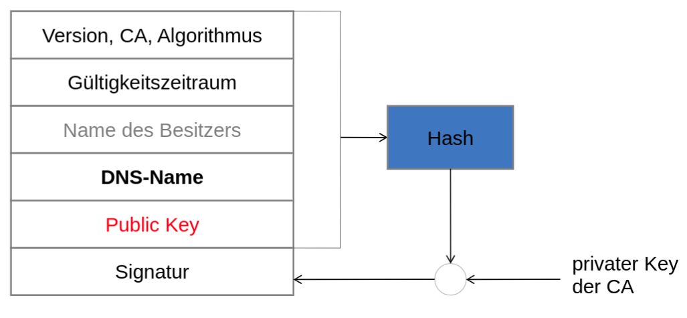

# TK-T SA 1

 
 

## Zertifikate

#### Klasse 1 Zertifikat

Nur die **Echtheit** der **Email** wird überprüft.

\pagebreak

#### Klasse 3 Zertifikat

Der **Antragsteller** muss sich **Persöhnlich Ausweisen** aka. **Identitätsprüfung**. 

 

#### Praktische Umsetzung

- Zertifikat Erstellen
- Zertifikat in den Zertifikatsspeicher Importieren
- Zertifikat am Client auswählen

\pagebreak

## TLS

#### X.509 Serverzertifikat

 

#### Tertifikasvalisierung

 

#### Shema

TLS_<Schlüsselaustauschverfahren>_WITH_<Verschlüsselungsverfahren>_<Nachrichtenauthentifizierung>

BSP: EDCHE_RSA_WITH_AES_256_GCM_SHA384

- **EDCHE** Schlüsselaustauschverfahren
- **RSA** Zertifikat Signatur Verfahren
- **AES** Verschlüsselungsverfahren
- **256** Schlüssellänge
- **GCM** Mode
- **SHA384** Hash Verfahren

 

#### Sclüsselaustauschverfahren

- Eliptic Curve
- Diffie-Hellman
- Clipher Siute