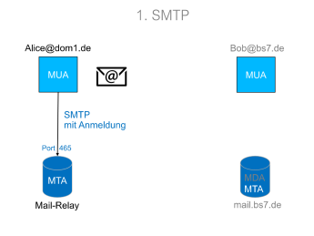

# 2 TK-SA

# VPN

aka: Virtual Private Network

 
 

## VPN Pakete

 
 

 
\pagebreak 

## End tp Site

 
 

## Site to Side

 
 

 
\pagebreak 

## HMAC

**Keyd Hash Message Code** zur **Intigrität** zum Überprüfen **von Nachrichten**

- Intigrität
- Verschlüsselung

 
 

 
\pagebreak 

# Mail

## Protokolle & Ports

- SMTP - 25
- POP - 110
- IMAP - 993

 
 

## Server, Agets, Transfer

- MTA = Mail Transfer Agent
- MUA = Mail User Agent
- SMTP => Transfer
- POP3, IMAP => Email abruf

 
 

## Email Transfer

 
 

## Email Abruf

### POP3

 
 

### IMAP

 
 

 
\pagebreak 

## Email RAW Aufbau

 
 

 
\pagebreak 

## Zusammenfassung

